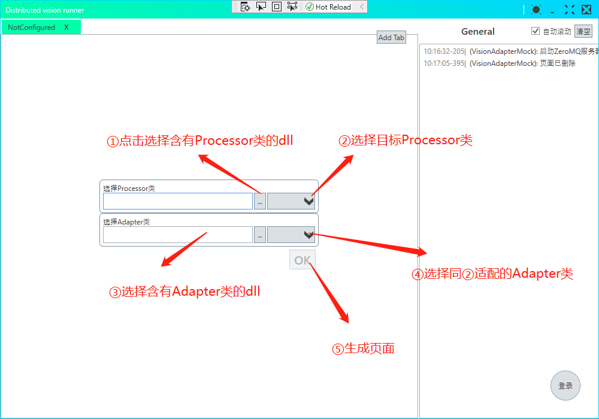
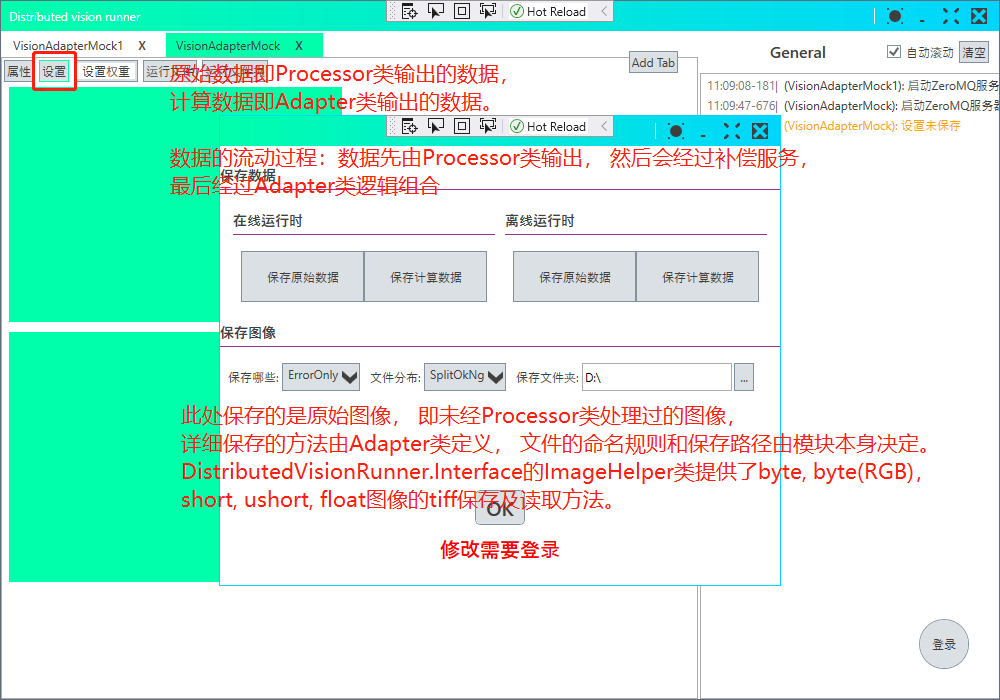
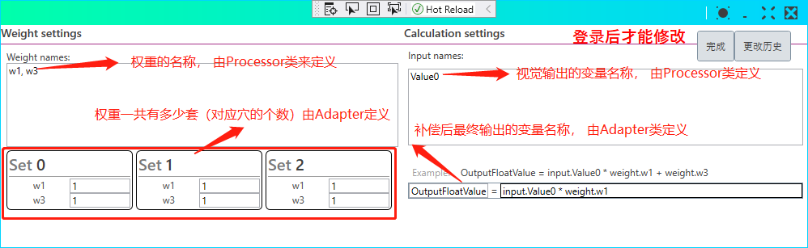

## 这是什么？
一个视觉处理的容器应用

## 能做什么？
1. 离线运行图像文件，显示图像， 输出数据到sqlite数据库
2. 接受来自上位机软件的`byte[]`， 除实现离线运行的功能外， 可以反馈数据和结果到上位机软件

## 特点？
1. 预置图像显示， 图像保存， 运行异常处理， 穴位(Cavity)补偿运算逻辑，省去上位机开发者重复进行以上工作
2. 分离上位机和图像处理程序， 避免图像处理代码中的内存问题导致上位机软件崩溃
3. 可作为Prism模块嵌入上位机程序
4. 作为独立应用时，通讯是基于ZeroMQ的， 因此上位机应用可以由任何有ZeroMQ库的语言来实现

## 短板？
1. 作为独立应用时， 受ZeroMQ的Request-respond模式限制， 不能平行运算多个处理请求。如果实际上多次发送请求， 上位机端会先引发ZeroMQ的异常， 因为Request-respond模式在ZeroMQ库层是禁止没有回复的连续请求的。*注: 作为Prism模块运行时支持多个处理请求同时进行。*
2. 通讯时间在图像数据较大时消耗较大。实测在i7-8565U, 1.8GHZ，4核心，内存2400MHZ 8GX2，的机器， 传送一组25,000,000 byte的数据平均耗时75ms
3. 受应用的设计限制，**每一次只处理一个穴(Cavity)的数据**，只支持以下的数据模式：
   - 一个byte[]等于一张图像
   - 一个byte[]等于多张图像， 图像传入后可以由自定义的方法切分， 即这些图像尺寸可以不一致。 这些图像共同来描述一个穴(Cavtiy)， 例如三维重构， 厚度测量等
4. 一张图像包含多个穴(Cavity)时, 可以在上位机端先切分图像, 然后分段请求处理
5. 目前支持的数据类型有byte, byte(RGB)， float, ushort, short, 其他数据类型的支持会在日后有需求时加入

## 使用(独立运行时)
### 视觉工程师
1. 引用Nuget包[DistributedVisionRunner.Interface](https://www.nuget.org/packages/DistributedVisionRunner.Interface/), 继承*IVisionProcessor\<TData>*
### 上位机工程师
1. 引用Nuget包[DistributedVisionRunner.Interface](https://www.nuget.org/packages/DistributedVisionRunner.Interface/), 继承*IVisionAdapter\<TData>*
2. 配置页面, 一个页面对应一个图像处理单元

3. 详细设置， 包括保存数据图片设置和补偿设置

## Processor类和Adapter类的设计思想及任务划分

## 使用(作为ALC的Prism模块时), 同独立运行的使用方法

## 依赖项
1. 用户管理服务: [到此处下载Release](https://gitee.com/believingheart/cygia-user-management/releases/1.0.0)并安装
2. Sqlite管理服务: [到此处下载Release](https://gitee.com/believingheart/cygia-sqlite-access-service/releases/V1.0.1)并安装
3. 捞Sqlite数据的应用: [到此处下载Release](https://gitee.com/believingheart/DataLog/releases/1.1.5.0)并安装

